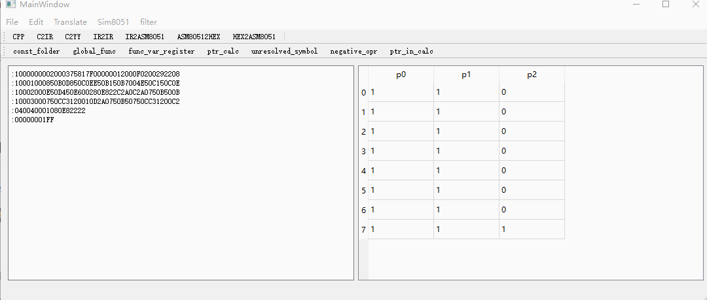
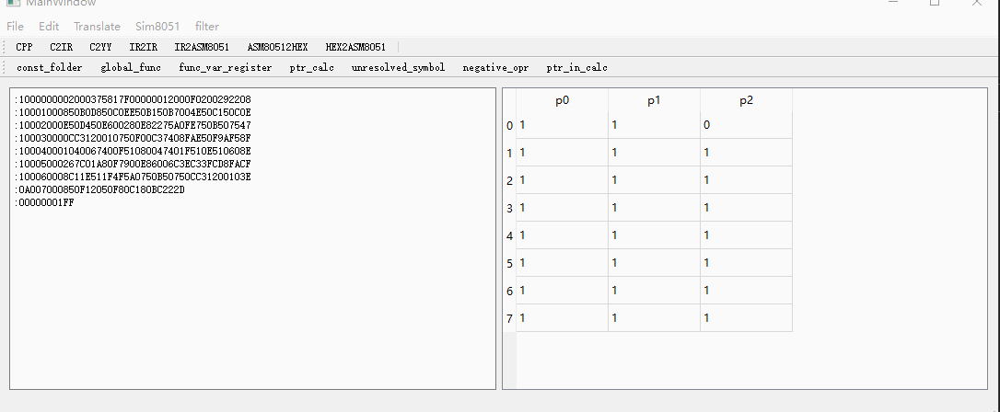

# MZC8051

https://jiangshan00001.github.io/


a c compiler for mcu8051.


示例程序：


```
#include "io.h"

int puts(const char *s)
{
while(*s !=0){
putc(*s);
++s;
}
}


int main()
{
puts("hellowrold\n");
return 0;
}


```


生成对应的ir

```
func:$putc,EXTERN(1);
	ret_type: $__putc_ret,i32;
	def_arg: $a,u8;
func_end:%putc;


func:$puts;
	ret_type: $__puts_ret,i32;
	def_arg: $s,u32*1*[u8, CONST(1) ];
	{:
#BS:_labelc_puts_0H;
def_var_tmp: $TMP_17f011d0,u8;
opr: "!=", var_in:%s*1;, iconst:0x0:0x8;, %TMP_17f011d0;
opr: "JZ", %TMP_17f011d0;, null;, @BS:_labelc_puts_1H;
{:
call:%putc;
var_in:%s*1;
call_end:%putc;
opr: "++", null;, null;, %s;
};
opr: "JMP", null;, null;, @BS:_labelc_puts_0H;
#BS:_labelc_puts_1H;
};
func_end:%puts;


func:$main;
	ret_type: $__main_ret,i32;
	{:
call:%puts;
cstring:"hellowrold\n";
call_end:%puts;
opr: "=", null;, iconst:0x0:0x8;, %__main_ret;
return;
};
func_end:%main;

```


欢迎任何人参与和完善：一个人可以走的很快，但是一群人却可以走的更远。


## 程序使用说明：

当前有3个例程在release中：
example_test: led01 led02 shumaguan01

以led01为例，说明代码编译流程：
```
cd led01;
../MZC8051.exe -x lmake -m clean -i .
../MZC8051.exe -x lmake -m make -i .
../MZC8051.exe -x sim8051 -i led01.hex
```
仿真运行结果：




[程序使用说明](doc/usage.md)


## 源码说明：

- [asm8051](doc/asm8051.md): 8051的asm到hex的汇编编译器
- [ir/irread](doc/ir.md): 定义的中间语言。中间语言的读写
- [cfront](doc/cfront.md): c语言的前端
- [backend/ir2asm8051](doc/ir2asm8051.md) ir转为8051汇编语言的后端代码
- [sim8051](doc/sim8051.md) 8051的仿真代码，用于测试验证生成的hex代码运行功能是否正确
- [lmake](doc/lmake.md) 简单的make的部分功能实现，用于生成项目和编译程序用
- [ide_one](doc/ide_one.md) 总体编译器统一集成编译项目
- [misc](doc/misc.md) 其他公共函数等
- 希望对编译器技术感兴趣的人一起讨论学习。
- 可以在项目的issues中讨论。

## 开发说明：

- [ir格式说明](doc/ir_format.md)
- [如何添加新的前端](doc/add_new_front_how_to.md)
- [如何添加新的后端](doc/add_new_backend_how_to.md)
- [如何添加新的中间代码过滤器](doc/add_new_filter_how_to.md)


some code is from github:

- json: https://github.com/nlohmann/json
- sim8051: https://github.com/andersdellien/8051-sim
- simplecpp: https://github.com/danmar/simplecpp

if there is any license issue, please contact me.

some resource I find useful:
-   LCC: A Retargetable C Compiler: Design and Implementation
    http://www.amazon.com/dp/0805316701,
    https://github.com/drh/lcc

-   TCC: Tiny C Compiler
    http://bellard.org/tcc/,
    http://repo.or.cz/w/tinycc.git/tree

-   C99 standard final draft
    http://www.open-std.org/jtc1/sc22/wg14/www/docs/n1124.pdf

-   C11 standard final draft
    http://www.open-std.org/jtc1/sc22/wg14/www/docs/n1570.pdf

-   Dave Prosser's C Preprocessing Algorithm
    http://www.spinellis.gr/blog/20060626/

-   The x86-64 ABI
    http://www.x86-64.org/documentation/abi.pdf
